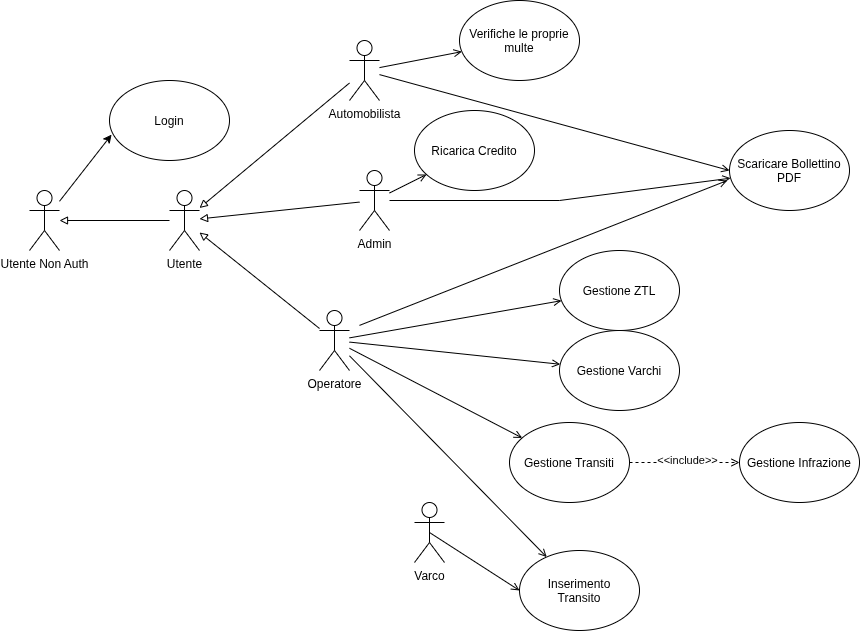

# ZTL_PA
## Backend Sistema di Gestione Multe ZTL

Realizzazione di un backend per la gestione del calcolo delle multe a seguito del passaggio di autoveicoli attraverso i varchi di una Zona a Traffico Limitato (ZTL). Per l'esame di Programmazione Avanzata (A.A. 2025/2026) del corso di Laurea Magistrale in Ingegneria Informatica e dell'Automazione UNIVPM
## Analisi dei Requisiti

### Attori

Il sistema prevede i seguenti attori:

- **Operatore**: attore autenticato mediante token JWT. Gestisce le ZTL e i varchi (creazione, modifica, consultazione, eliminazione), inserisce e gestisce i transiti (inserimento, consultazione, modifica, eliminazione) e può scaricare il bollettino di pagamento in formato PDF relativo a una multa.

- **Varco**: attore non umano, corrispondente al dispositivo automatico installato presso un varco ZTL. Autenticato mediante token JWT, il suo unico compito è l'inserimento dei transiti rilevati (targa, data e ora di passaggio).

- **Automobilista**: attore autenticato mediante token JWT. Può verificare se a proprio carico risultano multe non pagate, ottenendo anche l'identificativo del relativo bollettino, e può scaricare il bollettino di pagamento in formato PDF relativo a una multa.

- **Amministratore** (specializzazione dell'utente autenticato): in aggiunta all'autenticazione mediante JWT, può ricaricare il credito (token) di un utente specificandone l'indirizzo e-mail.

### Requisiti Funzionali

#### RF1 — Autenticazione

- Un utente (Operatore, Varco, Automobilista o Amministratore) fornisce le proprie credenziali e ottiene in cambio un token JWT.

#### RF2 — Gestione ZTL

- L'Operatore può creare, consultare, modificare ed eliminare una ZTL.
- Una città può avere più ZTL attive contemporaneamente.

#### RF3 — Gestione Varchi

- L'Operatore può creare, consultare, modificare ed eliminare un varco.
- Ogni varco è associato a una ZTL.
- Per ogni varco vengono definite le fasce orarie di apertura e chiusura, differenziabili per giorno della settimana (es. festivo/feriale).

#### RF4 — Modellazione Tipologie Veicolo

- Il sistema modella le tipologie di veicolo, ciascuna associata a una tariffa base.
- I dati relativi alle tipologie di veicolo sono inizializzati tramite script di seed.

#### RF5 — Gestione Transiti

- Un transito (targa, data e ora di passaggio, varco di riferimento) può essere inserito dall'Operatore o dal Varco.
- L'Operatore può consultare i transiti relativi a uno specifico varco.
- L'Operatore può modificare ed eliminare un transito.
- Un veicolo può attraversare più varchi ZTL nel corso della stessa giornata.

#### RF6 — Gestione Multe

- All'inserimento di un transito, il sistema verifica in automatico se il veicolo è soggetto a multa, in base alla tipologia di veicolo, alla fascia oraria e al giorno della settimana (festivo/feriale) del transito.
- Transiti multipli dello stesso veicolo attraverso lo stesso varco, nella medesima giornata, generano una sola multa.
- Ogni varco distinto attraversato dallo stesso veicolo, nella medesima giornata, genera una multa separata.
- Un veicolo presente in white list non viene multato.
- L'Automobilista può verificare se a proprio carico risultano multe, ottenendo anche l'identificativo del bollettino associato.
- L'Automobilista o l'Operatore possono scaricare il bollettino di pagamento in formato PDF, contenente targa, importo e un QR-code con la stringa `<uuid pagamento>|<multa id>|<targa>|<importo>`.

#### RF7 — Gestione Utenti e Token

- Ogni utente possiede un credito espresso in token, il cui valore iniziale è assegnato tramite script di seed.
- Ogni richiesta autenticata effettuata da un utente ne consuma il credito, con un costo differenziato in base al tipo di azione richiesta:
  - Creazione ZTL: 0.50 token
  - Creazione varco: 0.50 token
  - Inserimento transito: 0.10 token
  - Consultazione transiti di uno specifico varco: 0.05 token
  - Verifica multe a proprio carico: 0.05 token
  - Download bollettino di pagamento in formato PDF: 0.15 token
  - Modifica o eliminazione di ZTL, varco o transito: 0.10 token
- La ricarica del credito da parte dell'Amministratore non consuma credito all'Amministratore stesso.
- Se il credito di un utente è esaurito, le richieste successive dello stesso utente restituiscono `401 Unauthorized`.
- Un Amministratore può ricaricare il credito di un utente specificandone l'indirizzo e-mail e il nuovo valore di credito.

#### RF8 — Inizializzazione Sistema

- Uno script di seed inizializza il database con i dati minimi necessari al funzionamento del sistema: utenti (con relativo ruolo e credito iniziale), tipologie di veicolo con relative tariffe, e dati di esempio per ZTL e varchi.

### Diagramma dei casi d'uso

