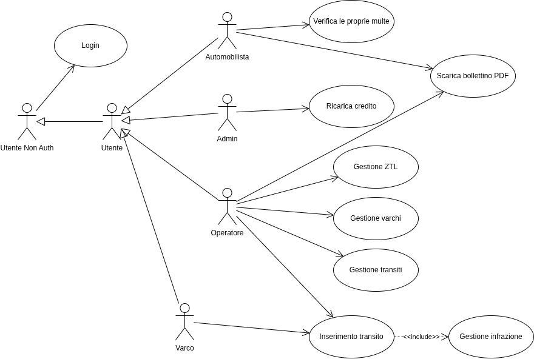
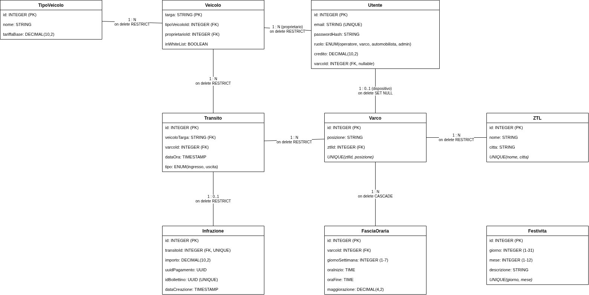
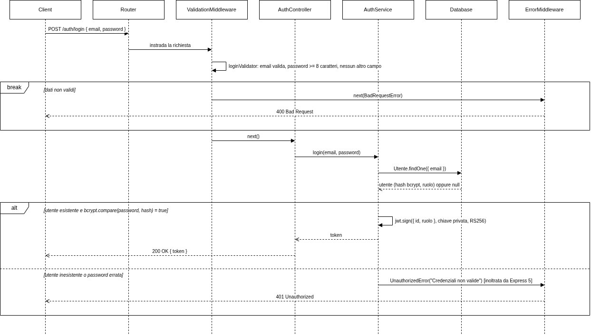
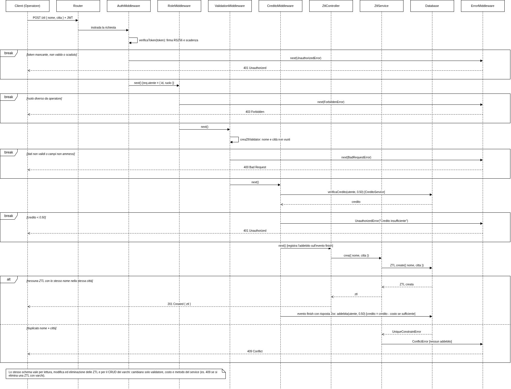
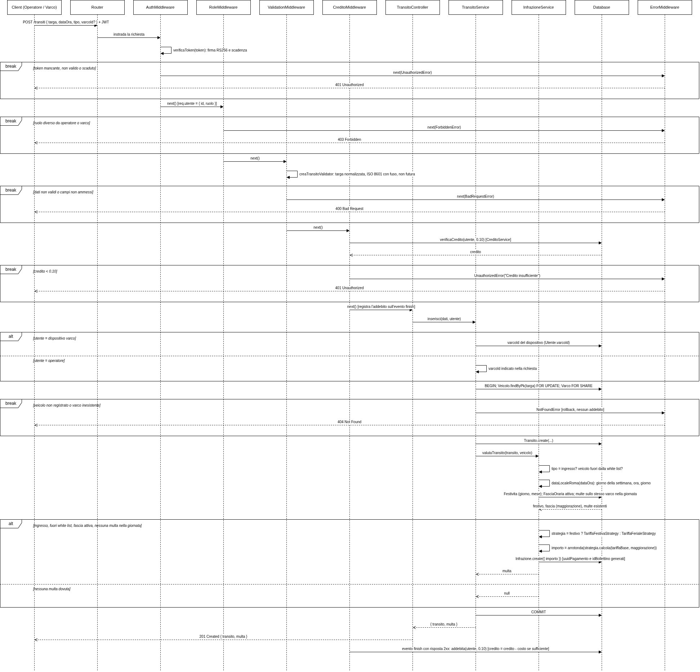
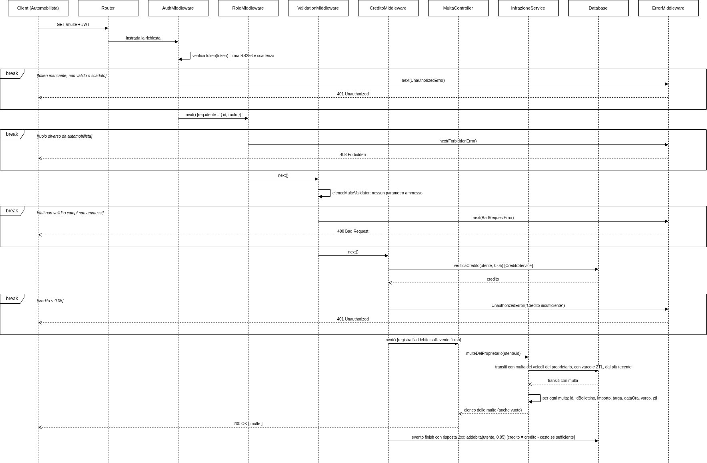
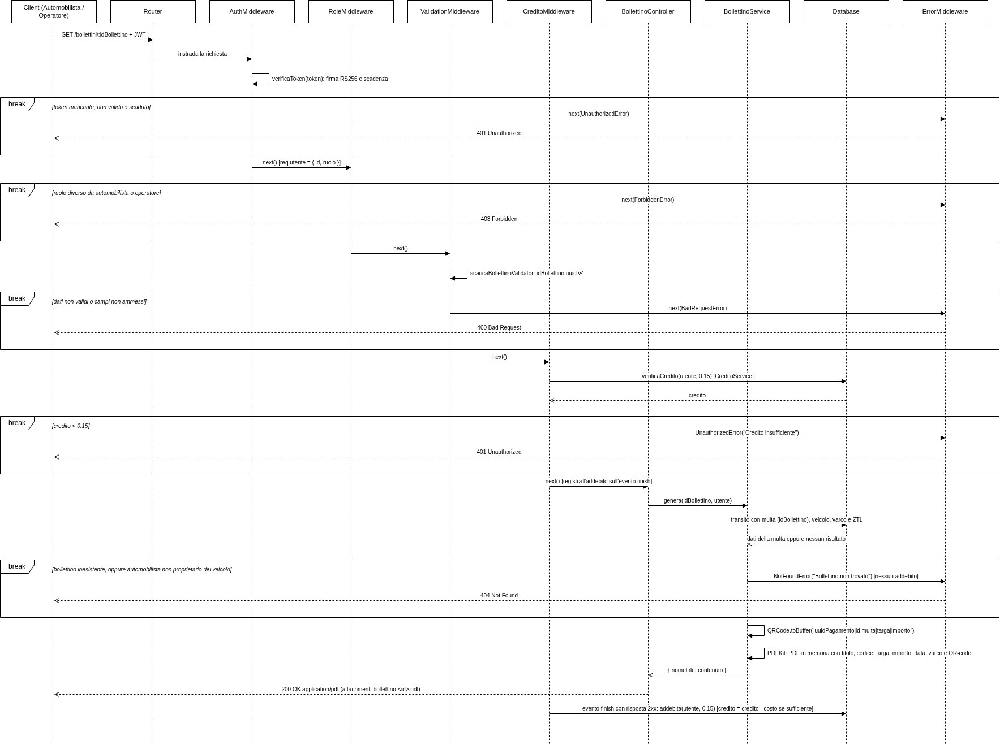
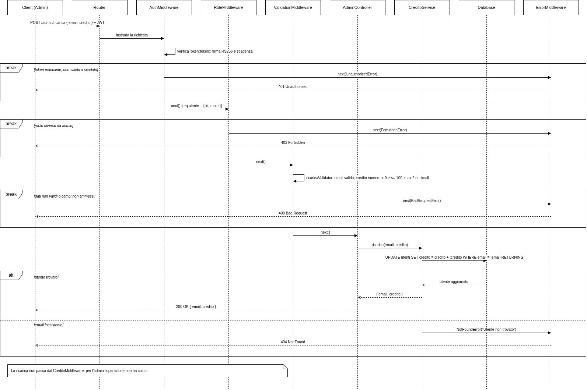

# ZTL_PA

## Backend per la gestione delle multe ZTL

Progetto d'esame di Programmazione Avanzata (A.A. 2025/2026), Laurea Magistrale in Ingegneria Informatica e dell'Automazione, Università Politecnica delle Marche.

## Indice

- [Obiettivo del progetto](#obiettivo-del-progetto)
- [Progettazione](#progettazione)
- [Avvio del progetto](#avvio-del-progetto)
- [Test con Jest](#test-con-jest)
- [Test con Postman](#test-con-postman)

## Obiettivo del progetto

Realizzazione di un backend per il calcolo delle multe generate dal passaggio di veicoli attraverso i varchi di una Zona a Traffico Limitato (ZTL). Il sistema gestisce ZTL e varchi con i relativi orari di attività, registra i transiti e, all'inserimento di ciascun transito, valuta in automatico se generare una multa, intestandola al proprietario del veicolo. Gli automobilisti possono consultare le proprie multe e scaricare il bollettino di pagamento in PDF con QR-code. Ogni utente dispone di un credito in token che viene consumato dalle richieste e può essere ricaricato da un amministratore.

## Progettazione

### Analisi dei requisiti

#### Attori

- **Operatore**: gestisce ZTL e varchi (creazione, consultazione, modifica, eliminazione), inserisce e gestisce i transiti, può scaricare il bollettino di qualunque multa.
- **Varco**: dispositivo installato presso un varco fisico. Il suo unico compito è inserire i transiti rilevati sul proprio varco.
- **Automobilista**: verifica le multe a proprio carico, ottenendo anche l'identificativo del bollettino, e scarica il bollettino delle proprie multe.
- **Amministratore**: ricarica il credito di un utente indicandone l'indirizzo e-mail.

Tutti gli attori si autenticano con un token JWT ottenuto tramite login.

#### Requisiti funzionali

##### RF1 — Autenticazione

- Un utente fornisce e-mail e password (almeno 8 caratteri) e ottiene un token JWT contenente solo i dati essenziali (identificativo e ruolo).

##### RF2 — Gestione ZTL

- L'Operatore può creare, consultare, modificare ed eliminare una ZTL.
- Una città può avere più ZTL, ma nella stessa città non possono esistere due ZTL con lo stesso nome.
- Una ZTL con varchi associati non può essere eliminata, per preservare lo storico dei transiti.

##### RF3 — Gestione varchi e fasce orarie

- L'Operatore può creare, consultare, modificare ed eliminare un varco, indicandone la posizione e la ZTL di appartenenza. Nella stessa ZTL non possono esistere due varchi nella stessa posizione.
- Ogni varco ha delle fasce orarie in cui è attivo, definite per giorno della settimana (lunedì–domenica) con ora di inizio e di fine. Un giorno può avere più fasce, che non possono sovrapporsi; una fascia notturna si divide su due giorni (es. 20:00–24:00 e 00:00–02:00).
- Ogni fascia ha una maggiorazione che moltiplica la tariffa base.
- Nei giorni festivi (domeniche e festività nazionali) valgono le fasce della domenica.
- Le fasce vengono inviate e salvate insieme al varco; in modifica vengono sostituite per intero.
- Un varco con transiti registrati non può essere eliminato né spostato in un'altra ZTL.

##### RF4 — Veicoli e tipologie

- Ogni veicolo, identificato dalla targa, ha una tipologia e un proprietario a cui vengono intestate le multe.
- Ogni tipologia di veicolo ha una tariffa base (auto 80 €, moto 50 €, camion 120 €).
- I veicoli in white list non vengono mai multati.
- Veicoli e tipologie vengono inizializzati tramite lo script di seed.

##### RF5 — Gestione transiti

- Un transito è composto da targa, data e ora del passaggio, varco e tipo (ingresso o uscita).
- L'Operatore inserisce un transito indicando il varco; il dispositivo Varco lo inserisce senza indicarlo, perché viene usato il varco a cui è collegato.
- La data e l'ora devono indicare il fuso orario (formato ISO 8601) e non possono essere nel futuro.
- Sono accettati solo transiti di veicoli registrati.
- L'Operatore può consultare i transiti di uno specifico varco, ciascuno con l'eventuale multa.
- L'Operatore può modificare ed eliminare un transito solo se non ha generato una multa.

##### RF6 — Multe e bollettini

- La multa viene valutata solo all'inserimento di un transito, e viene generata se:
  - il transito è un ingresso;
  - il veicolo non è in white list;
  - il passaggio avviene in una fascia attiva del varco, valutata nel fuso orario di Roma;
  - il veicolo non ha già una multa sullo stesso varco nella stessa giornata.
- Un veicolo che attraversa varchi diversi nella stessa giornata riceve una multa per ciascun varco.
- L'importo è la tariffa base della tipologia del veicolo moltiplicata per la maggiorazione della fascia, e ulteriormente per 1,5 nei giorni festivi; viene arrotondato al centesimo.
- Ogni multa ha un identificativo di pagamento e un identificativo del bollettino, generati automaticamente.
- L'Automobilista può verificare tutte le multe dei veicoli di cui è proprietario, con identificativo del bollettino, importo, targa, data, varco e ZTL.
- L'Automobilista può scaricare il bollettino delle proprie multe, l'Operatore di qualunque multa. Il bollettino è un PDF con targa, importo, data, varco e un QR-code con la stringa `<uuid pagamento>|<multa id>|<targa>|<importo>`.

##### RF7 — Credito e ricarica

- Ogni utente ha un credito in token, con valore iniziale impostato nello script di seed.
- Ogni richiesta autenticata ha un costo:

  | Operazione | Costo |
  |---|---|
  | Consultazione di ZTL o varchi | 0,05 |
  | Creazione di una ZTL o di un varco | 0,50 |
  | Modifica o eliminazione di una ZTL o di un varco | 0,10 |
  | Inserimento di un transito | 0,10 |
  | Consultazione dei transiti di un varco | 0,05 |
  | Modifica o eliminazione di un transito | 0,10 |
  | Verifica delle multe | 0,05 |
  | Download del bollettino | 0,15 |

- Se il credito non copre il costo dell'operazione, la richiesta riceve `401 Unauthorized`.
- Il costo viene addebitato solo se l'operazione va a buon fine.
- L'Amministratore ricarica il credito di un utente indicandone l'e-mail e il credito da aggiungere (maggiore di 0, al massimo 100, con al più due decimali). Il "nuovo credito" indicato dalla traccia è interpretato come importo che si somma al saldo attuale, coerentemente con il termine "ricarica". La ricarica non ha costo per l'Amministratore.

##### RF8 — Inizializzazione

- Lo script di seed crea: una ZTL con un varco e le sue fasce orarie, un utente per ruolo con il credito iniziale (il dispositivo Varco collegato al varco), le tipologie di veicolo, alcuni veicoli dell'automobilista (uno in white list) e le festività nazionali.

### Diagramma dei casi d'uso



### Architettura

Il backend è sviluppato in TypeScript con Node.js ed Express, usa Sequelize come ORM e PostgreSQL come database. Il codice è organizzato a livelli, ciascuno con una sola responsabilità:

```
Rotte → Middleware → Controller → Service → Model → Database
```

- **Rotte**: associano ogni indirizzo alla sequenza di middleware e al controller che lo gestiscono.
- **Middleware**: controlli eseguiti prima della logica, organizzati come una catena (autenticazione, ruolo, validazione, credito) più un gestore finale degli errori.
- **Controller**: leggono i dati già validati dalla richiesta, chiamano il service e costruiscono la risposta HTTP.
- **Service**: contengono la logica dell'applicazione (calcolo delle multe, gestione del credito, generazione del bollettino).
- **Model**: rappresentano le tabelle del database tramite Sequelize.

Ogni richiesta autenticata attraversa la stessa catena di middleware:

```
autenticazione JWT → controllo del ruolo → validazione → verifica del credito → controller
```

Ogni anello può far proseguire la richiesta oppure interromperla con un errore (401, 403, 400). Gli errori, compresi quelli lanciati dai service (404, 409), arrivano a un unico middleware finale che li trasforma in risposte JSON con il codice HTTP corretto. Il credito viene verificato prima dell'operazione e addebitato solo dopo una risposta di successo.

Le dipendenze tra i componenti sono gestite con la **Dependency Injection**: controller e middleware ricevono i service dal costruttore, tipizzati tramite interfacce (`IAuthService`, `ICreditoService`, `ITransitoService`, `IInfrazioneService`, `IBollettinoService`). Tutti gli oggetti vengono creati e collegati in un unico punto, `src/container.ts`, l'unico file che conosce le classi concrete. Questo rende i componenti indipendenti tra loro e permette di sostituire un service con uno finto nei test.

Struttura del progetto:

```
src/
├── config/        configurazione (variabili d'ambiente, connessione al database, costi in token)
├── models/        model Sequelize e relazioni tra tabelle
├── interfaces/    contratti dei service
├── services/      logica dell'applicazione
├── strategies/    strategie di calcolo della tariffa
├── controllers/   gestione delle richieste HTTP
├── middlewares/   catena dei middleware e gestione degli errori
├── validators/    regole di validazione delle richieste
├── routes/        definizione delle rotte
├── errors/        classi degli errori applicativi
├── utils/         calcolo di giorno e ora nel fuso di Roma
├── seed/          script di inizializzazione del database
├── container.ts   creazione e collegamento dei componenti
├── app.ts         configurazione di Express
└── server.ts      avvio del server
tests/
└── middlewares/   test Jest dei middleware
```

### Modello dei dati



### Diagrammi di sequenza

Nei diagrammi delle rotte autenticate la richiesta attraversa sempre la stessa catena di middleware (autenticazione, ruolo, validazione, credito); ogni anello può interromperla con un errore, che arriva al client tramite il middleware di gestione degli errori. Il credito viene addebitato solo dopo una risposta di successo.

#### Login

Verifica delle credenziali e rilascio del token JWT firmato con RS256; credenziali errate o dati non validi producono un errore.



#### Gestione ZTL

Creazione di una ZTL, come esempio rappresentativo dei CRUD di ZTL e varchi: la creazione riuscita viene addebitata, un duplicato produce un 409 senza addebito.



#### Inserimento di un transito

Inserimento da parte dell'operatore o del dispositivo varco, con valutazione automatica della multa: fascia attiva nel fuso di Roma, festività, white list, multa già emessa nella giornata e scelta della strategia di calcolo della tariffa.



#### Verifica delle multe

L'automobilista ottiene l'elenco delle multe dei propri veicoli, con l'identificativo del bollettino di ciascuna.



#### Download del bollettino

Generazione del bollettino PDF con QR-code; l'automobilista può scaricare solo i bollettini delle proprie multe, l'operatore qualunque bollettino.



#### Ricarica del credito

L'amministratore aggiunge credito a un utente indicandone l'e-mail; l'operazione non ha costo.



### Pattern utilizzati

#### Singleton — connessione al database

**Dove**: `src/config/database.ts`

**Perché**: l'applicazione deve usare un'unica connessione al database, condivisa da tutti i componenti. Aprirne una nuova per ogni richiesta sprecherebbe risorse e potrebbe esaurire le connessioni disponibili su PostgreSQL. L'istanza di Sequelize viene creata una sola volta, al primo import del modulo, e ogni altro import riceve la stessa istanza.

```typescript
// connessione unica al database, condivisa da tutta l'applicazione
const sequelize = new Sequelize(env.db.nome, env.db.utente, env.db.password, {
  host: env.db.host,
  port: env.db.porta,
  dialect: 'postgres',
  logging: false,
});

export default sequelize;
```

#### Chain of Responsibility — middleware

**Dove**: `src/middlewares/` e la definizione delle rotte in `src/routes/`

**Perché**: ogni richiesta deve superare una serie di controlli indipendenti (autenticazione, ruolo, validazione, credito) prima di arrivare al controller. Con una catena di middleware ogni controllo è un anello separato, con una sola responsabilità, che decide se far proseguire la richiesta (`next()`) oppure interromperla con un errore (`next(errore)`). I controlli si combinano diversamente per ogni rotta, si riusano ovunque e si testano singolarmente. L'ultimo anello, `errorMiddleware`, trasforma qualunque errore in una risposta JSON.

```typescript
// la catena di una rotta: ogni anello viene eseguito solo se il precedente ha chiamato next()
router.use(autenticazione, roleMiddleware('operatore'));
router.post('/', creaZtlValidator, validationMiddleware, credito(COSTI.creazioneZtl), ztlController.crea);
```

```typescript
// un anello della catena: prosegue oppure interrompe con un errore
export function roleMiddleware(...ruoliAmmessi: Ruolo[]): RequestHandler {
  return (req, res, next) => {
    if (!req.utente) {
      return next(new UnauthorizedError('Utente non autenticato'));
    }
    if (!ruoliAmmessi.includes(req.utente.ruolo)) {
      return next(new ForbiddenError());
    }
    next();
  };
}
```

#### Strategy — calcolo della tariffa

**Dove**: `src/strategies/` e `src/services/InfrazioneService.ts`

**Perché**: la traccia chiede tariffe differenziate anche per giorno della settimana. Il calcolo dell'importo cambia tra giorni feriali e festivi, quindi ogni regola è incapsulata in una strategia che implementa la stessa interfaccia. Il servizio delle multe sceglie la strategia in base alla data del transito e poi la usa senza sapere quale sia. Aggiungere una nuova regola (per esempio una tariffa notturna) richiede solo una nuova strategia, senza modificare il servizio. Le due strategie vengono create in `container.ts` e iniettate nel servizio.

```typescript
// contratto comune a tutte le strategie
export interface TariffaStrategy {
  calcola(tariffaBase: number, maggiorazione: number): number;
}

export class TariffaFerialeStrategy implements TariffaStrategy {
  calcola(tariffaBase: number, maggiorazione: number): number {
    return tariffaBase * maggiorazione;
  }
}

export class TariffaFestivaStrategy implements TariffaStrategy {
  calcola(tariffaBase: number, maggiorazione: number): number {
    return tariffaBase * maggiorazione * COEFFICIENTE_FESTIVO;
  }
}
```

```typescript
// nel servizio delle multe: scelta della strategia in base al giorno, poi uso tramite l'interfaccia
const strategia = festivo ? this.tariffaFestiva : this.tariffaFeriale;
const importo = this.arrotondaAlCentesimo(strategia.calcola(tipo.tariffaBase, fascia.maggiorazione));
```

## Avvio del progetto

### Prerequisiti

- [Docker](https://docs.docker.com/get-docker/) con Docker Compose
- [Node.js](https://nodejs.org/) 20 o superiore, usato solo per installare le dipendenze e generare le chiavi JWT

### Passi

1. Clonare il repository ed entrare nella cartella:

   ```bash
   git clone https://github.com/otech99/ZTL_PA.git
   cd ZTL_PA
   ```

2. Installare le dipendenze:

   ```bash
   npm install
   ```

3. Generare la coppia di chiavi RS256 per i token JWT:

   ```bash
   npm run generate-keys
   ```

   Lo script crea il file `.env` a partire da `.env.example`, se non esiste già, e vi scrive la chiave privata e la chiave pubblica. Rilanciandolo le chiavi vengono rigenerate e i token emessi in precedenza non sono più validi.

4. Avviare database e backend:

   ```bash
   docker compose up --build -d
   ```

   Il backend parte solo quando il database è pronto ed è raggiungibile su `http://localhost:3000`.

5. Inizializzare il database con i dati di prova:

   ```bash
   docker compose exec backend npm run seed
   ```

   Il seed ricrea tutte le tabelle, quindi può essere rilanciato per tornare alla situazione iniziale.

Per fermare i servizi:

```bash
docker compose down
```

Aggiungendo `-v` viene eliminato anche il volume del database.

### Dati iniziali

Il seed crea una ZTL (*Centro Storico*, Ancona) con un varco (*Piazza Cavour*) attivo dal lunedì al venerdì 07:30–19:30 e il sabato 10:00–14:00, le festività nazionali e un utente per ruolo, tutti con password `password123`:

| Email | Ruolo | Credito iniziale |
|---|---|---|
| operatore@ztl.it | operatore | 10 |
| varco@ztl.it | varco (collegato a *Piazza Cavour*) | 10 |
| automobilista@ztl.it | automobilista | 10 |
| admin@ztl.it | admin | 100 |

Veicoli dell'automobilista:

| Targa | Tipo | Tariffa base | White list |
|---|---|---|---|
| AB123CD | auto | 80 | no |
| EF456GH | moto | 50 | no |
| IL789MN | camion | 120 | no |
| WL000AA | auto | 80 | sì |

## Test con Jest

I test verificano due middleware della catena, `authMiddleware` e `creditoMiddleware`, in isolamento: i service vengono sostituiti da oggetti finti grazie alla dependency injection, quindi non servono né il database né il server avviato.

```bash
npm test
```

| Middleware | Caso verificato |
|---|---|
| `authMiddleware` | Richiesta senza token: `401`, il token non viene verificato |
| `authMiddleware` | Token valido: i dati dell'utente vengono salvati nella richiesta e la catena prosegue |
| `authMiddleware` | Token non valido o scaduto: `401` |
| `creditoMiddleware` | Credito insufficiente: `401`, la catena non prosegue e non viene addebitato nulla |
| `creditoMiddleware` | Credito sufficiente: la catena prosegue e il costo viene addebitato solo dopo l'invio di una risposta di successo |
| `creditoMiddleware` | Risposta di errore: nessun addebito |
| `creditoMiddleware` | Utente non autenticato: `401`, il credito non viene interrogato |

## Test con Postman

La collection `postman/ZTL_PA.postman_collection.json` contiene 50 richieste che coprono tutte le rotte, sia nei casi di successo sia nei principali casi di errore. Ogni richiesta verifica il codice HTTP atteso tramite uno script di test.

### Esecuzione

1. Avviare il progetto ed eseguire il seed, come descritto in [Avvio del progetto](#avvio-del-progetto).
2. In Postman selezionare **Import** e scegliere il file della collection.
3. Eseguire l'intera collection con **Run** (Collection Runner), mantenendo l'ordine delle richieste.

Le richieste della cartella *Auth* eseguono il login dei quattro utenti del seed e salvano i token nelle variabili della collection (`tokenOperatore`, `tokenVarco`, `tokenAutomobilista`, `tokenAdmin`); le richieste successive li usano automaticamente. Allo stesso modo vengono salvati gli identificativi creati durante l'esecuzione (ZTL, varco, transiti, bollettino). La collection può essere eseguita più volte senza ripetere il seed.

In alternativa la collection può essere eseguita da terminale con Newman, il runner a riga di comando di Postman:

```bash
npx newman run postman/ZTL_PA.postman_collection.json
```

### Contenuto

| Cartella | Casi di successo | Casi di errore |
|---|---|---|
| Auth | Login dei quattro ruoli | Password errata `401`, e-mail non valida `400` |
| ZTL | Creazione, elenco, dettaglio, modifica, eliminazione | ZTL già esistente `409`, campo non ammesso `400`, senza token `401`, ruolo non autorizzato `403`, ZTL eliminata `404` |
| Varchi | Creazione con fasce orarie, elenco, dettaglio, modifica, eliminazione | Fasce sovrapposte `400`, eliminazione di una ZTL con varchi `409` |
| Transiti | Transito con multa in giorno feriale e festivo, secondo transito nella stessa giornata senza nuova multa, veicolo in white list senza multa, inserimento dal dispositivo varco, elenco per varco, modifica ed eliminazione di un transito senza multa | Dispositivo che indica il varco `400`, veicolo non registrato `404`, targa non testuale `400`, modifica o eliminazione di un transito con multa `409`, consultazione da parte del dispositivo varco `403` |
| Multe | Elenco delle multe dell'automobilista | Richiesta dell'operatore `403` |
| Bollettini | Download del PDF da parte dell'automobilista e dell'operatore | Bollettino inesistente `404`, identificativo non valido `400` |
| Admin | Ricarica del credito | Credito come testo `400`, credito oltre il massimo `400`, utente inesistente `404`, richiesta dell'operatore `403` |

Il varco creato dalla collection è attivo tutti i giorni a ogni ora, così i transiti di prova, con date fisse nel passato, generano sempre la multa. Il bollettino si salva come file PDF con **Send and Download**.